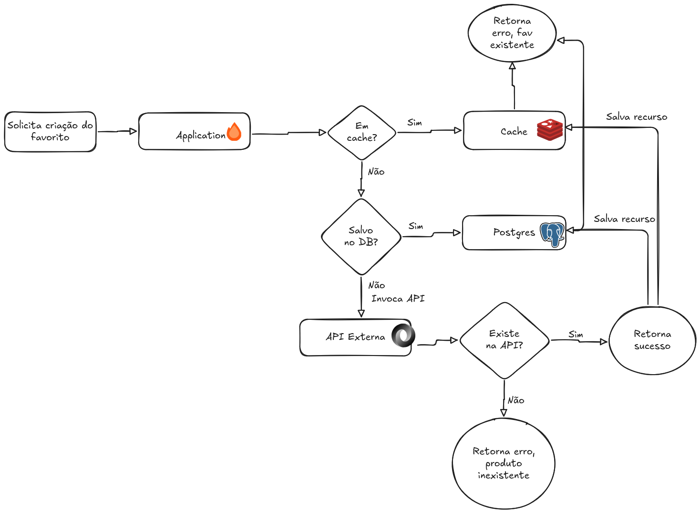
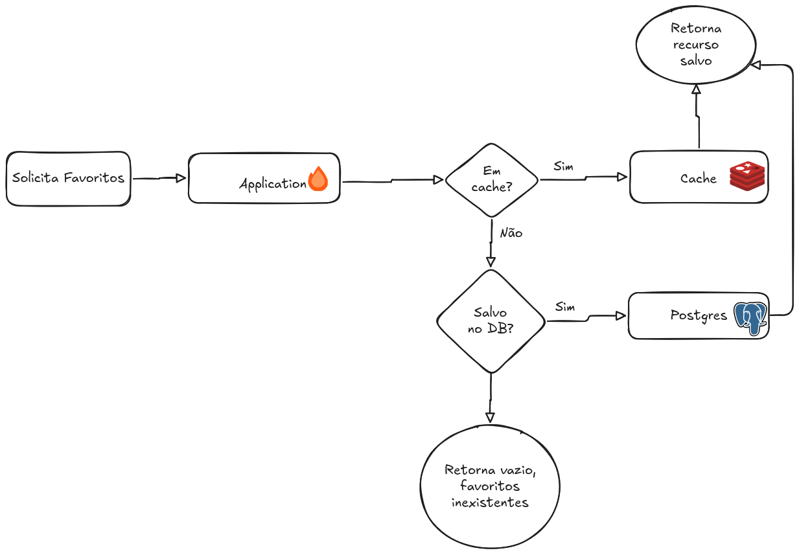

# Aiqfome + Hono!

Este projeto é o repositório para o app de cadastro de clientes e seus respectivos pedidos favoritos.

## Fluxos

### Criação de favoritos



### Listagem de favoritos



> For other deployment examples see the [hono-node-deployment-examples](https://github.com/w3cj/hono-node-deployment-examples) repo

## Incluso

- Logging com [pino](https://getpino.io/) / [hono-pino](https://www.npmjs.com/package/hono-pino)
- Rotas documentadas com Zos [@hono/zod-openapi](https://github.com/honojs/middleware/tree/main/packages/zod-openapi)
- Interactive API documentation with [scalar](https://scalar.com/#api-docs) / [@scalar/hono-api-reference](https://github.com/scalar/scalar/tree/main/packages/hono-api-reference)
- Convenience methods / helpers to reduce boilerplate with [stoker](https://www.npmjs.com/package/stoker)
- Type-safe schemas and environment variables with [zod](https://zod.dev/)
- Single source of truth database schemas with [drizzle](https://orm.drizzle.team/docs/overview) and [drizzle-zod](https://orm.drizzle.team/docs/zod)
- Testing with [vitest](https://vitest.dev/)
- Sensible editor, formatting and linting settings with [@antfu/eslint-config](https://github.com/antfu/eslint-config)

## Setup

Create `.env` file

```sh
cp .env.example .env
```

Install dependencies

```sh
pnpm install
```

Create postgres db / push schema

```sh
pnpm drizzle-kit push
```

Run

```sh
pnpm dev
```

Lint

```sh
pnpm lint
```

Test

```sh
pnpm test
```

E2E Test

```sh
pnpm test:integration
```

## Code Tour

Base hono app exported from [app.ts](./src/app.ts). Local development uses [@hono/node-server](https://hono.dev/docs/getting-started/nodejs) defined in [index.ts](./src/index.ts) - update this file or create a new entry point to use your preferred runtime.

Typesafe env defined in [env.ts](./src/env.ts) - add any other required environment variables here. The application will not start if any required environment variables are missing

See [src/routes/clients](./src/routes/clients/) for an example Open API group. Copy this folder / use as an example for your route groups.

- Router created in [clients.index.ts](./src/routes/clients/clients.index.ts)
- Route definitions defined in [clients.routes.ts](./src/routes/clients/clients.routes.ts)
- Hono request handlers defined in [clients.handlers.ts](./src/routes/clients/clients.handlers.ts)
- Group unit tests defined in [clients.test.ts](./src/routes/clients/clients.test.ts)

All app routes are grouped together and exported into single type as `AppType` in [app.ts](./src/app.ts) for use in [RPC / hono/client](https://hono.dev/docs/guides/rpc).

## Endpoints

| Path                                    | Description                                     |
| --------------------------------------- | ----------------------------------------------- |
| GET /doc                                | Open API Specification                          |
| GET /reference                          | Scalar API Documentation                        |
| GET /clients                            | Lista todos os clientes                         |
| POST /clients                           | Cria uma instância de clientes                  |
| GET /clients/{id}                       | Busca clientes por id                           |
| PATCH /clients/{id}                     | Atualiza um cliente por id                      |
| DELETE /clients/{id}                    | Deleta um cliente por id                        |
| GET /clients/{id}/favourites            | Lista todos os favoritos de clientes            |
| POST /clients/{id}/favourites           | Cria uma instância de favoritos para um cliente |
| GET /clients/{id}/favourites/{favId}    | Busca favoritos do cliente por id               |
| DELETE /clients/{id}/favourites/{favId} | Deleta um favorito por id                       |

## References

- [What is Open API?](https://swagger.io/docs/specification/v3_0/about/)
- [Hono](https://hono.dev/)
  - [Zod OpenAPI Example](https://hono.dev/examples/zod-openapi)
  - [Testing](https://hono.dev/docs/guides/testing)
  - [Testing Helper](https://hono.dev/docs/helpers/testing)
- [@hono/zod-openapi](https://github.com/honojs/middleware/tree/main/packages/zod-openapi)
- [Scalar Documentation](https://github.com/scalar/scalar/tree/main/?tab=readme-ov-file#documentation)
  - [Themes / Layout](https://github.com/scalar/scalar/blob/main/documentation/themes.md)
  - [Configuration](https://github.com/scalar/scalar/blob/main/documentation/configuration.md)
